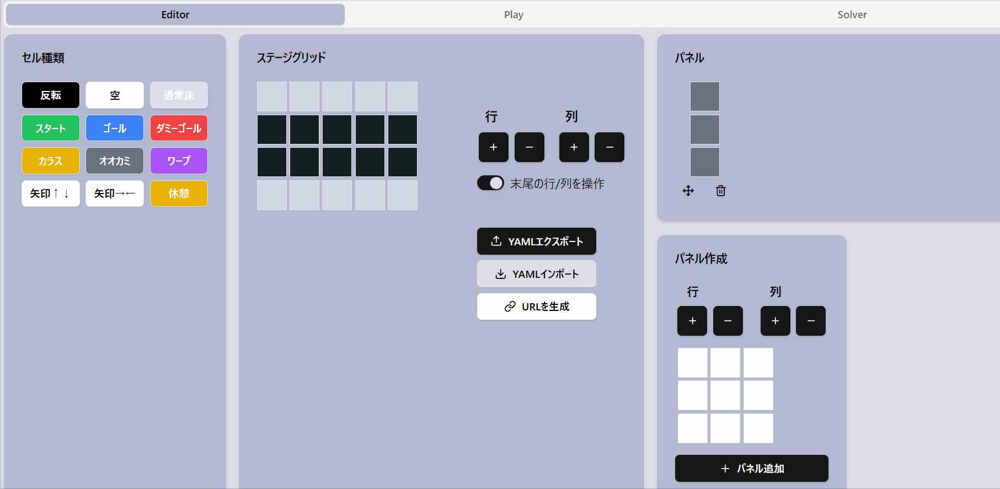
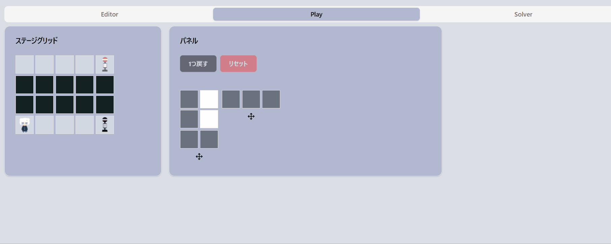
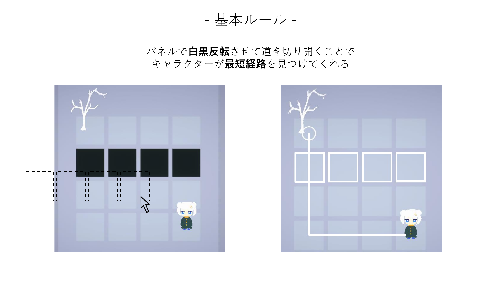
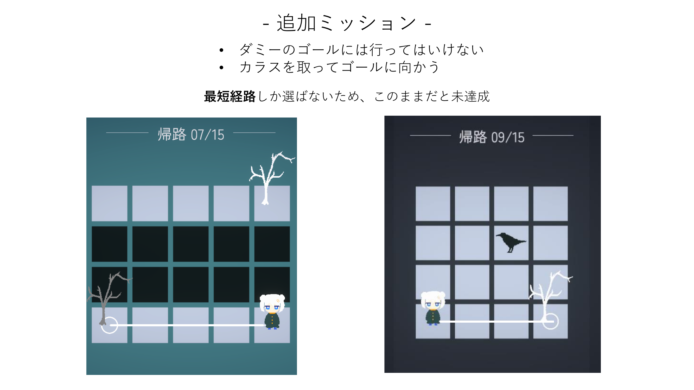
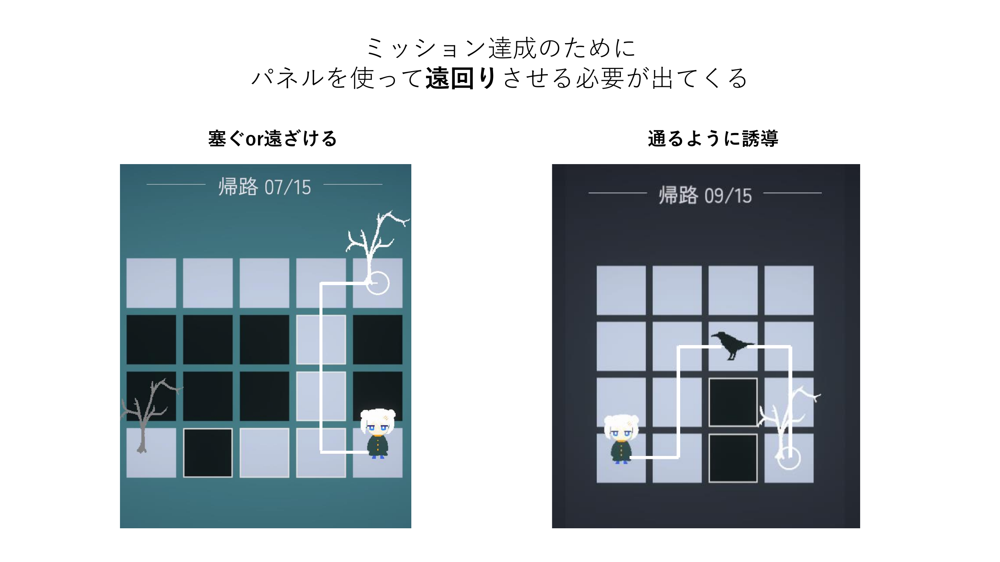

# 『帰路』Stage Editor

目下作成中のパズルゲーム『帰路』でのWebステージエディタツールです。
Unityに依存せず、受け渡しをYamlで行えるような補助ツールを作成したく、取り組んでいます。   
https://kiro-stage-editor-708973678663.asia-northeast1.run.app/

## 『帰路』について
Steamストア公開しています。
https://store.steampowered.com/app/3409620/

- 3月：体験版公開予定
- 7月：正式リリース予定  

## 機能
### Editorモード
- マップ、パネルの作成
- URL共有機能：作ったステージを遊うための機能
- Yamlのエクスポート/インポート機能：Unity受け渡し用

### Playモード
- お試しでパネル設置
- undo, reset機能

### Solverモード
- 今後制作予定

## パズルのルール

