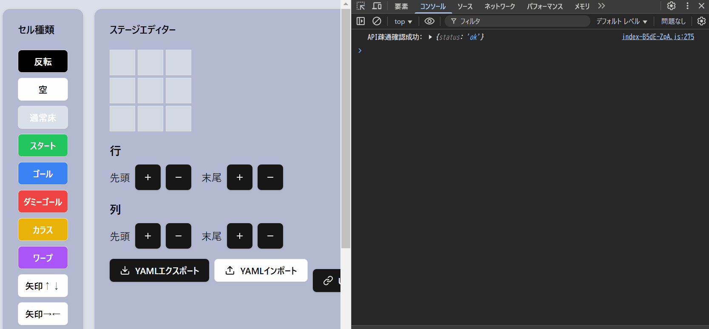

# Redux

### 概要
- 全てのStateをStoreで一元管理
  - propsでのバケツリレーが不要となる
- 関数型プログラミング的思想があり、Stateの変更はReducer（純粋関数）を通さないと実施できない
  - そのためStateの変更の流れが追いやすい



### デメリット
- ボイラープレートが結構派手で、毎回書くことが少し多い
- 非同期処理が面倒らしい（backend連携時に再度考える）

### プロジェクト構成（概要）
```
├── src
│   ├── components
│   │   ├── editor
│   │   │   ├── cell-type-selector.tsx
│   │   │   ├── grid.tsx
│   │   │   ├── new-panel-creator.tsx
│   │   │   └── panel-list.tsx
│   ├── main.tsx
│   ├── pages
│   │   └── editor-page.tsx
│   ├── store
│   │   ├── index.ts
│   │   └── slices
│   │       ├── cell-type-slice.ts
│   │       ├── create-panel-slice.ts
│   │       ├── grid-slice.ts
│   │       ├── panel-list-slice.ts
│   │       └── panel-placement-slice.ts
```

# 手順
1. Providerで囲む
2. Sliceを用意し、Storeに登録
3. コンポーネントにて使用

## 1. Providerで囲む
Providerコンポーネントを囲むことで、配下のコンポーネントにStoreが適用される

main.tsx
```ts
createRoot(document.getElementById('root')!).render(
  <StrictMode>
    <Provider store={store}>
      <EditorPage />
    </Provider>
  </StrictMode>,
)
```

## 2. Sliceを用意し、Storeに登録

Sliceを用意
```
│   │   └── slices
│   │       ├── cell-type-slice.ts
│   │       ├── create-panel-slice.ts
│   │       ├── grid-slice.ts
│   │       ├── panel-list-slice.ts
│   │       └── panel-placement-slice.ts
```

例）
```ts
export const createPanelSlice = createSlice({
  name: "create-panel",
  initialState,
  reducers: {
    // パネルグリッドの初期化
    initPanelGrid: (state) => {
      state.newPanelGrid = Array(3)
        .fill(null)
        .map(() => Array(3).fill("White"));
    },

    // パネルグリッドの行・列の追加・削除
    addToRow: (state) => {
      state.newPanelGrid.push(
        Array(state.newPanelGrid[0].length).fill("White")
      );
    },
    addToCol: (state) => {
      state.newPanelGrid = state.newPanelGrid.map((row) => [...row, "White"]);
    },
    removeFromRow: (state) => {
      state.newPanelGrid.pop();
    },
    removeFromCol: (state) => {
      state.newPanelGrid = state.newPanelGrid.map((row) =>
        row.slice(0, row.length - 1)
      );
    },

    // セル反転
    clickToCell: (
      state,
      action: PayloadAction<{ row: number; col: number }>
    ) => {
      const { row, col } = action.payload;
      state.newPanelGrid[row][col] =
        state.newPanelGrid[row][col] === "Black" ? "White" : "Black";
    },
  },
});
```

そしてstore/index.tsにて定義
```ts
export const store = configureStore({
  reducer: {
    cellType: cellTypeReducer,
    panelList: panelListReducer,
    panelPlacement: panelPlacementReducer,
    createPanel: createPanelReducer,
    grid: gridReducer,
  },
  middleware: (getDefaultMiddleware) => 
    getDefaultMiddleware().concat(logger),
});

export type RootState = ReturnType<typeof store.getState>;
export type AppDispatch = typeof store.dispatch;
```

## 3. コンポーネントにて使用

- stateを参照したい：useSelector->store->各state
- stateを操作したい：useDispatch->各slice->reducer

```ts

import { createPanelSlice } from "../../store/slices/create-panel-slice";
import { useDispatch, useSelector } from "react-redux";
import { RootState } from "../../store";

  const newPanelGrid = useSelector((state: RootState) => state.createPanel.newPanelGrid);

  const dispatch = useDispatch();

          <Button
            onClick={() => dispatch(createPanelSlice.actions.addToRow())}
            className="flex items-center gap-2"
          >
```