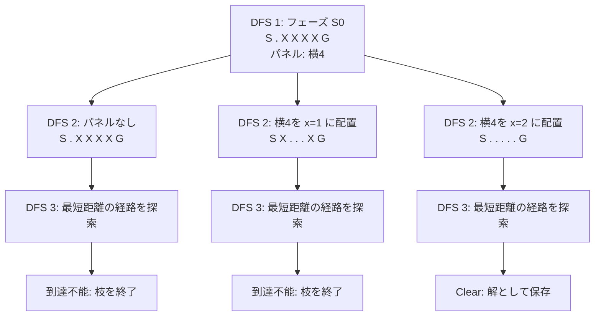
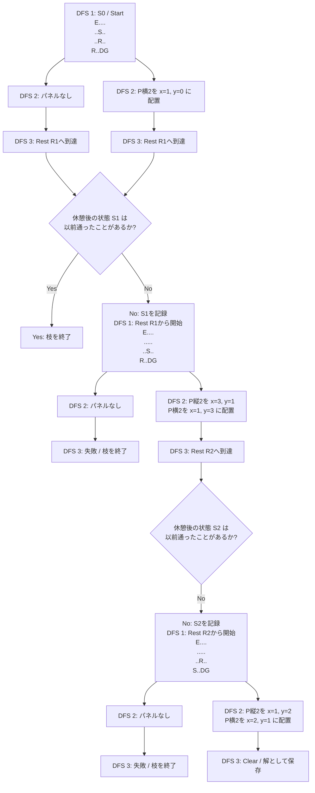

# ソルバー全体のフロー

```text
DFS 1：フェーズ状態を探索
│
└─ 現在のフェーズ
   └─ DFS 2：パネル配置順を全探索
      └─ 各配置盤面を評価
         └─ DFS 3：最短距離の経路を探索
              │
              ├─ Clear ─────────────→ 解として保存
              ├─ 失敗・到達不能 ────→ この枝を終了
              ├─ Flag / Switch ─────→ 変化後の盤面でDFS 2を継続
              └─ Rest到達
                   ↓
                 休憩後の状態 S' は以前通ったことがあるか？
                   ├─ Yes → この枝を終了
                   └─ No  → S'を記録し、DFS 1で次フェーズを探索

```

## 例1: 反転のみ

`solver.basic.test.ts`の「基本的なパズル1を解く」を使う。

```text
cells=h1w7gswbbbbg
panels=h1w4gbbbb
```





## 実例2: 複数のRest

`solver.rest.test.ts`の「複数Rest地点があるパズルを解く」を使う。

```text
cells=h4w5gewwwwwwswwwwrwwrwwdg
panels=h1w2gbb_h2w1gbb
```



